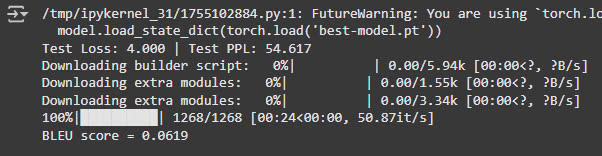

# Byte Pairing Encoding vs Word-based for Sequence To Sequence (Seq2Seq) Model in Neural Machine Translation.

- This project is inspired by the paper [Neural Machine Translation of Rare Words with Subword Units](https://arxiv.org/abs/1508.07909), in which the authors propose a method for handling rare words in neural machine translation by utilizing subword units. Based on this approach, I implemented a Seq2Seq model and trained it using both Byte Pair Encoding (BPE) and word-based tokenization techniques to compare their performance and understand the differences between these two methods.
- The dataset used in this project is [iwslt2015-en-vi](https://huggingface.co/datasets/thainq107/iwslt2015-en-vi) with 133k samples train data, 1.2k validation data, and 1.2k test data.
- It took me totally 13 hours to train this model. Roughly 6.5 hours for each method

## File Structure

BPE-vs-Word-based-for-Seq2Seq-Model-in-Neural-Machine-Translation/

├── BPE_Seq2seq.py

├── BPE_seq2seq.ipynb

├── BaseModel.py

├── BaseModel_with_BatchNorm.py

├── BaseModel_with_Dropout.py

├── BaseModel_with_SkipConnection.py

├── model.py

└── README.md

- `BPE_Seq2seq.py`:  A .py file to overview my code for BPE method.
- `BPE_seq2seq.ipynb`: A jupyter notebook that trains Seq2Seq model using BPE Method.
- `bpe.jpg`: The BLEU Score of BPE Method.
- `word-based.jpg`: The BLEU Score of Word-based Method.
- `word_based_seq2seq.ipynb`: A jupyter notebook that trains Seq2Seq model using Word-based Method.
- `word_based_seq2seq.py`: A .py file to overview my code for Word-based method.
- `README.md`

# 🔴Note: I divided this project into 2 types of files: .ipynb and .py because if you want to run on ggcolab🚀 to observe the results as my codeflow, you can download file .ipynb and run it, ✅but if you want to have an overview of Seq2seq model using BPE and Word-based Tokenization you can check my .py files

## Introduction & Implementation

**BPE Method**: BPE tokenization is a method of dividing a vocabulary into subwords. BPE uses a learning algorithm to find pairs of bytes (or character pairs) that appear frequently in a text and replace them with a single character or token. This reduces the size of the vocabulary and handles rare words efficiently. You can research and read BPE in paper or [Byte Pairing Encoding](https://www.geeksforgeeks.org/byte-pair-encoding-bpe-in-nlp/)

- For BPE tokenization, I use BPE and BpeTrainer from Hugging Face's tokenizers library. BPE is a method of breaking words into subwords instead of segmenting words into independent tokens.

- After training, words are broken down into subwords. For example, the word "machine" can be broken down into sub-tokens like ["ma", "chi", "ne"] instead of keeping it as "machine". Similarly, the word "unhappiness" can be broken down into ["un", "happiness"].

- This helps the model better handle out-of-vocabulary (OOV) words by using word parts instead of needing a large vocabulary containing all possible words.
  
```python
# English tokenizer
tokenizer_en = Tokenizer(BPE())
tokenizer_en.pre_tokenizer = Whitespace()
trainer_en = BpeTrainer(
    vocab_size=30000,
    special_tokens=["<unk>", "<p ad>", "<sos>", "<eos>"]
)
tokenizer_en.train_from_iterator(train_data["en"], trainer=trainer_en)

# Vietnamese tokenizer
tokenizer_vi = Tokenizer(BPE())
tokenizer_vi.pre_tokenizer = Whitespace()
trainer_vi = BpeTrainer(
    vocab_size=30000,
    special_tokens=["<unk>", "<pad>", "<sos>", "<eos>"]
)
tokenizer_vi.train_from_iterator(train_data["vi"], trainer=trainer_vi)

```

**Word-based Method**: Word-based tokenization is a method of dividing text into words without using subwords. Each word will be a separate token, helping the model learn the vocabulary directly without dividing the word into subwords.

- For WordLevel tokenization, you are using the WordLevel and WordLevelTrainer classes from Hugging Face's tokenizers library to train the tokenization model based on the vocabulary words in the dataset.

- After training, each word in the text will be split into independent tokens.

- For example, the sentence "I love NLP" will be split into ["I", "love", "NLP"].
  
```python
## English tokenizer
tokenizer_en = Tokenizer(WordLevel(unk_token="<unk>"))
tokenizer_en.pre_tokenizer = Whitespace()
trainer_en = WordLevelTrainer(
    vocab_size=30000,
    special_tokens=["<unk>", "<pad>", "<sos>", "<eos>"]
)
tokenizer_en.train_from_iterator(train_data["en"], trainer=trainer_en)

## Vietnamese tokenizer
tokenizer_vi = Tokenizer(WordLevel(unk_token="<unk>"))
tokenizer_vi.pre_tokenizer = Whitespace()
trainer_vi = WordLevelTrainer(
    vocab_size=30000,
    special_tokens=["<unk>", "<pad>", "<sos>", "<eos>"]
)
tokenizer_vi.train_from_iterator(train_data["vi"], trainer=trainer_vi)

```


## Result 

| Model                                        | Test Accuracy |   BLEU Score  |
|----------------------------------------------|---------------|---------------|
| Seq2Seq Model using BPE Tokenization         |    56.574     |     0.0685    |
| Seq2Seq Model using Word-based Tokenization  |    54.617     |     0.0619    |





# 🔴Note: All images illustrating the result and data of Seq2Seq model using BPE and Word-based Tokenization in the .ipynb file, or you can run to test by yourself.

## Conclusion: 

- In this project, we explored and compared two different tokenization methods: **Byte Pair Encoding (BPE)** and **Word-based Tokenization** for training Seq2Seq models in Neural Machine Translation (NMT). The results highlight that BPE tokenization performs better in handling rare and out-of-vocabulary (OOV) words compared to word-based tokenization.

- This approach leads to a more compact vocabulary, allowing the model to handle unseen words effectively by breaking them down into subwords.


## Requirement

✅ You can run code on googlecollab, jupyter or Kaggle notebooks, ... following my "BPE_seq2seq.ipynb.ipynb" and "word_based_seq2seq.ipynb" file.
